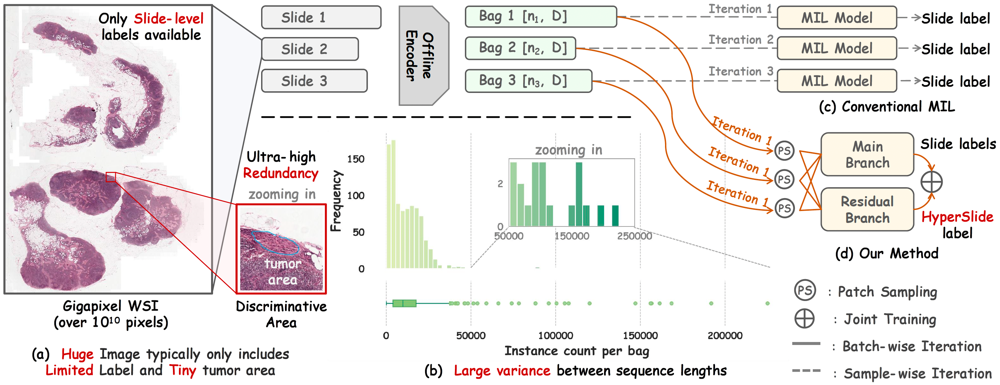

<h1 align="center"> Revisiting Data Challenges of Computational Pathology: A Pack-based Multiple Instance Learning Framework </h1>

<p align="center">
<a href="https://arxiv.org/pdf/2509.20923"></a>
<a href=""></a>
<a href="https://pan.baidu.com/s/1OuiIP3sB68IGZeId4s4K7Q?pwd=ujtq"></a>
<!-- <a href=""></a> -->
</p>

<h5 align="center"><em>Wenhao Tang<sup>*</sup>, Heng Fang<sup>*</sup>, Ge Wu, Xiang Li<sup>†</sup>, Ming-Ming Cheng<sup>†</sup> </em></h5>

This repository provides the **official PyTorch implementation** of the **PackMIL framework** introduced in **Revisiting Data Challenges of Computational Pathology: A Pack-based Multiple Instance Learning Framework**.

<p align="center">
  <a href="#what-is-packmil">What is PackMIL?</a> |
  <!-- <a href="#abstract">Abstract</a> | -->
  <a href="#usage">Usage</a> |
  <a href="#citation">Citation</a> 
</p >


# What is PackMIL?
- **Pack once, batch anywhere** – we pack multiple variable-length WSI feature sequences into fixed-length “packs”, enabling **true batched slide-level training** while **preserving slide-level heterogeneity**.
- **Residual branch with _hyperslides_** – discarded patches are reused to form hyperslides that supply **multi-slide supervision**, reducing feature loss from sampling.
- **Attention-driven downsampler** – compresses redundant features on-the-fly without sacrificing discriminative regions.



<details>
  <summary>
    <b style="font-size: 1.5em;">Abstract</b>
  </summary>

Computational pathology (CPath) digitizes pathology slides into whole slide images (WSIs), enabling analysis for critical healthcare tasks such as cancer diagnosis and prognosis. However, WSIs possess **extremely long sequence lengths** (up to 200K), **significant length variations** (from 200 to 200K), and **limited supervision**. These extreme variations in sequence length lead to high data heterogeneity and redundancy. Conventional methods often compromise on training efficiency and optimization to preserve such heterogeneity under limited supervision. To comprehensively address these challenges, we propose a pack-based MIL framework. It packs multiple sampled, variable-length feature sequences into fixed-length ones, enabling batched training while preserving data heterogeneity. Moreover, we introduce a residual branch that composes discarded features from multiple slides into a *hyperslide* which is trained with tailored labels. It offers multi-slide supervision while mitigating feature loss from sampling. Meanwhile, an attention-driven downsampler is introduced to compress features in both branches to reduce redundancy. By alleviating these challenges, our approach achieves an accuracy improvement of up to 8\% while using only 12\% of the training time in the PANDA(UNI). Extensive experiments demonstrate that focusing data challenges in CPath holds significant potential in the era of foundation models. 
</details>

<!-- # Abstract
Computational pathology (CPath) digitizes pathology slides into whole slide images (WSIs), enabling analysis for critical healthcare tasks such as cancer diagnosis and prognosis. However, WSIs possess **extremely long sequence lengths** (up to 200K), **significant length variations** (from 200 to 200K), and **limited supervision**. These extreme variations in sequence length lead to high data heterogeneity and redundancy. Conventional methods often compromise on training efficiency and optimization to preserve such heterogeneity under limited supervision. To comprehensively address these challenges, we propose a pack-based MIL framework. It packs multiple sampled, variable-length feature sequences into fixed-length ones, enabling batched training while preserving data heterogeneity. Moreover, we introduce a residual branch that composes discarded features from multiple slides into a *hyperslide* which is trained with tailored labels. It offers multi-slide supervision while mitigating feature loss from sampling. Meanwhile, an attention-driven downsampler is introduced to compress features in both branches to reduce redundancy. By alleviating these challenges, our approach achieves an accuracy improvement of up to 8\% while using only 12\% of the training time in the PANDA(UNI). Extensive experiments demonstrate that focusing data challenges in CPath holds significant potential in the era of foundation models.  -->


# TODO

- [x] Add the code for the training and testing of the model.
- [x] Add the code for the preprocessing of the datasets.
- [x] Upload experiment Docker environment.
- [ ] Upload the extracted features of the datasets (Huggingface, Baidu Netdisk, and ModelScope).
- [ ] Add the code for the visualization of the results.
- [ ] Improving README document.
<!-- - [ ] Improving the code structure. -->


# Usage
## 1. Environment Preparation

We recommend using Docker for a reproducible environment. Alternatively, you can install dependencies via PyPI.

#### Option 1: Docker (Recommended)

1. Download the Docker Image: [Docker Image Link](https://pan.baidu.com/s/1crrTL-9NWp3otkiYw6z8dw?pwd=2025) (Password: 2025)
2. Load the Docker image:
    ```bash
    docker load -i XXX.tar
    ```
    (Replace `XXX.tar` with the downloaded file name.)
3. Run the Docker container:
    ```bash
    docker run --gpus all -it --ipc=host --ulimit memlock=-1 --ulimit stack=67108864\
                -v /path/to/your_code:/workspace/code \
                -v /path/to/your_data:/workspace/dataset \
                -v /path/to/your_output:/workspace/output \
                --name packmil \
                --runtime=nvidia \
                -e NVIDIA_VISIBLE_DEVICES=all \
                -e NVIDIA_DRIVER_CAPABILITIES=compute,utility \
                -d packmil:latest /bin/bash
    ```

#### Option 2: PyPI

1.  Create a new Python environment:
    ```bash
    conda create -n packmil python=3.9
    conda activate packmil
    ```
2.  Install the required packages. 
    A complete list of requirements can be found in [requirements.txt](./requirements.txt).
    ```bash
    pip install -r requirements.txt
    ```

## 2. Data Preprocessing

#### Download Preprocessed Feature

We provide preprocessed patch features for all datasets. You can download them from:
[Hugginface](), [Baidu Netdisk](https://pan.baidu.com/s/1OuiIP3sB68IGZeId4s4K7Q?pwd=ujtq) (Password: ujtq)

#### Preprocess Raw Data

If you have raw Whole-Slide Image (WSI) data, you can preprocess it as follows:

1. **Patching** (Following [CLAM](https://github.com/mahmoodlab/CLAM/)):

    ```bash
    python CLAM/create_patches_fp.py --source YOUR_DATA_DIRECTORY \
                                     --save_dir YOUR_RESULTS_DIRECTORY \
                                     --patch_size 256 \
                                     --step_size 256 \
                                     --patch_level 0 \
                                     --preset YOUR_PRESET_FILE \
                                     --seg \
                                     --patch
    ```
    *Replace placeholders like `YOUR_DATA_DIRECTORY` with your actual paths and parameters. Preset files are officially provided by CLAM.*

2. **Feature Extraction** (Modify on the official [CLAM](https://github.com/mahmoodlab/CLAM/) repository to support the encoders of [CHIEF](https://github.com/hms-dbmi/CHIEF), [UNI](https://github.com/mahmoodlab/UNI) and [GIGAP](https://github.com/prov-gigapath/prov-gigapath)):
   
    > You can also extract all the required features following the process of [TRIDENT](https://github.com/mahmoodlab/TRIDENT).

    ```bash
    CUDA_VISIBLE_DEVICES=$TARGET_GPUs python extract_features_fp.py \
                                        --data_h5_dir DIR_TO_COORDS \
                                        --data_slide_dir DATA_DIRECTORY \
                                        --csv_path CSV_FILE_NAME \
                                        --feat_dir FEATURES_DIRECTORY \
                                        --slide_ext .svs \
                                        --model_name uni_v1/chief/gigap
    ```

<!-- ## 3. Using the Model Independently
``` python
from modules.packmil import DAttentionX 

# Example instantiation
abmilx_model = DAttentionX(
    input_dim=1024,       # Dimension of input features (e.g., from ResNet)
    n_classes=2,          # Number of output classes
    mil_bias=True,
    attn_bias=True,
    n_heads=8             # Number of attention heads; sweep {2, 4, 8, 16} for best performance
)

# For a single bag, shape would be (1, N, D)
# example_features = torch.randn(1, 1000, 1024) # 1 bag, 1000 instances, 1024 feature dimension
# bag_prediction = abmilx_model(example_features) # Output shape: (1, n_classes)
``` -->

## 3. Training

- Grading

```bash
CUDA_VISIBLE_DEVICES=$TARGET_GPU bash single_train.sh train --datasets=panda --project=your_project --dataset_root=/path/to/your/dataset -c=../config/feat_pack_panda.yaml --title={fm}_panda_abmil_bs128_packdual40_lr10 --csv_path=/path/to/your/label --model=abmil --log_iter=100 --output_path=/path/to/your/output/ --batch_size=128 --token_dropout=0.4 --input_dim=feat_dim --wandb
```

- Sub-typing

```bash
CUDA_VISIBLE_DEVICES=$TARGET_GPU bash single_train.sh train --datasets=brca --project=your_project --dataset_root=/path/to/your/dataset -c=../config/feat_pack_brca.yaml --title={fm}_brca_abmil_bs32_packdual60_dsr4_lr05 --csv_path=/path/to/your/label --model=abmil --log_iter=10 --output_path=/path/to/your/output/ --batch_size=32 --token_dropout=0.5 --input_dim=feat_dim --wandb
```

- Survival

```bash
CUDA_VISIBLE_DEVICES=$TARGET_GPU bash single_train.sh train --datasets=surv_{dataset} --project=your_project --dataset_root=/path/to/your/dataset -c=../config/feat_surv.yaml --title=surv_{fm}_brca_abmil_bs32_packdual50_dsr4_lr05 --csv_path=/path/to/your/survival_label --model=abmil --log_iter=10 --output_path=/path/to/your/output/ --batch_size=32 --token_dropout=0.5 --input_dim=feat_dim --wandb
```

<!-- ## Packed You Model -->


# Citation
If you find this repository useful for your research, please consider citing our paper:

```bibtex
@misc{tang2025revisitingdatachallengescomputational,
      title={Revisiting Data Challenges of Computational Pathology: A Pack-based Multiple Instance Learning Framework}, 
      author={Wenhao Tang and Heng Fang and Ge Wu and Xiang Li and Ming-Ming Cheng},
      year={2025},
      eprint={2509.20923},
      archivePrefix={arXiv},
      primaryClass={cs.CV},
      url={https://arxiv.org/abs/2509.20923}, 
}
```